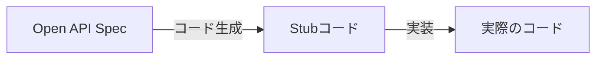
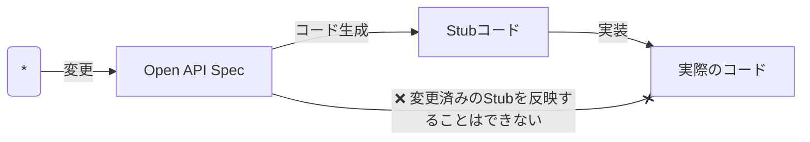
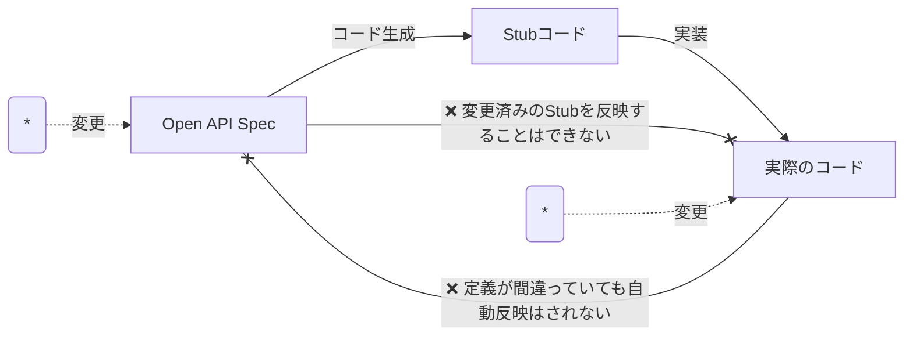
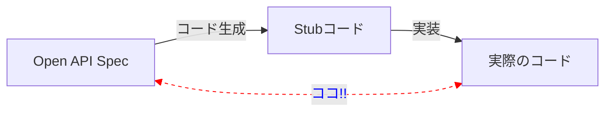
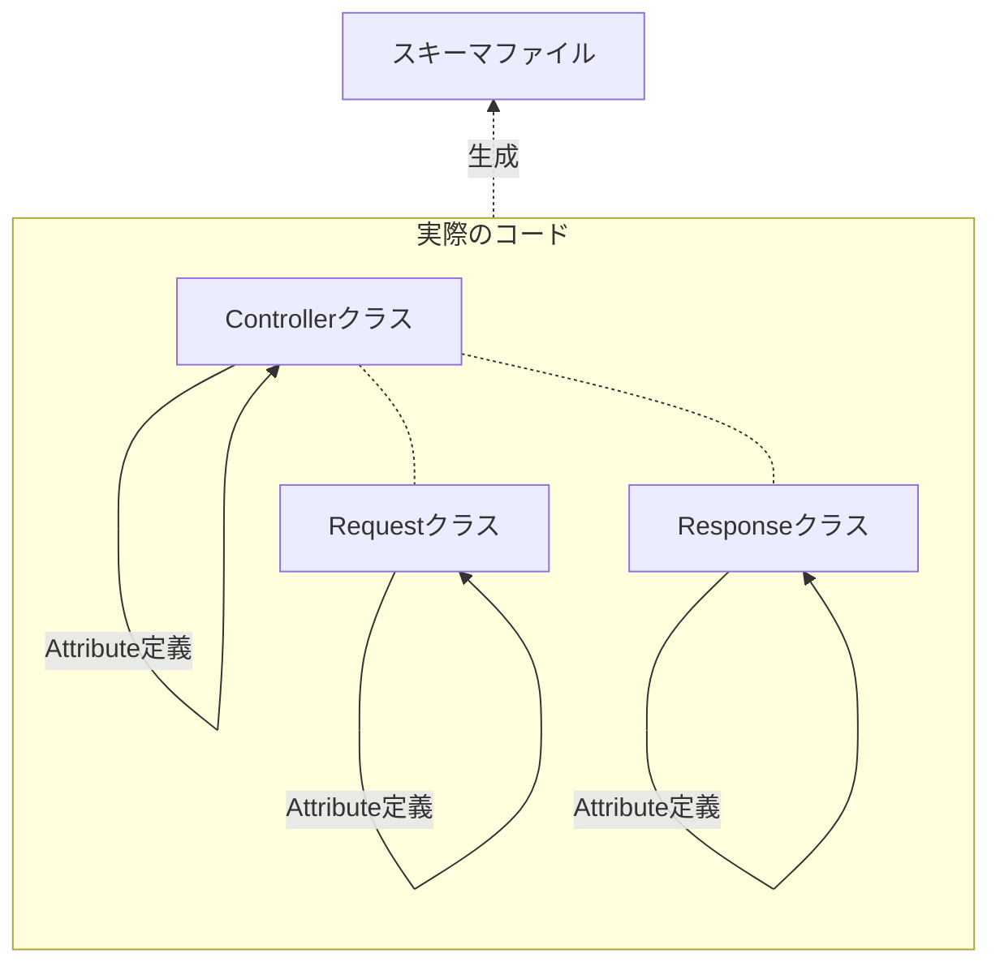
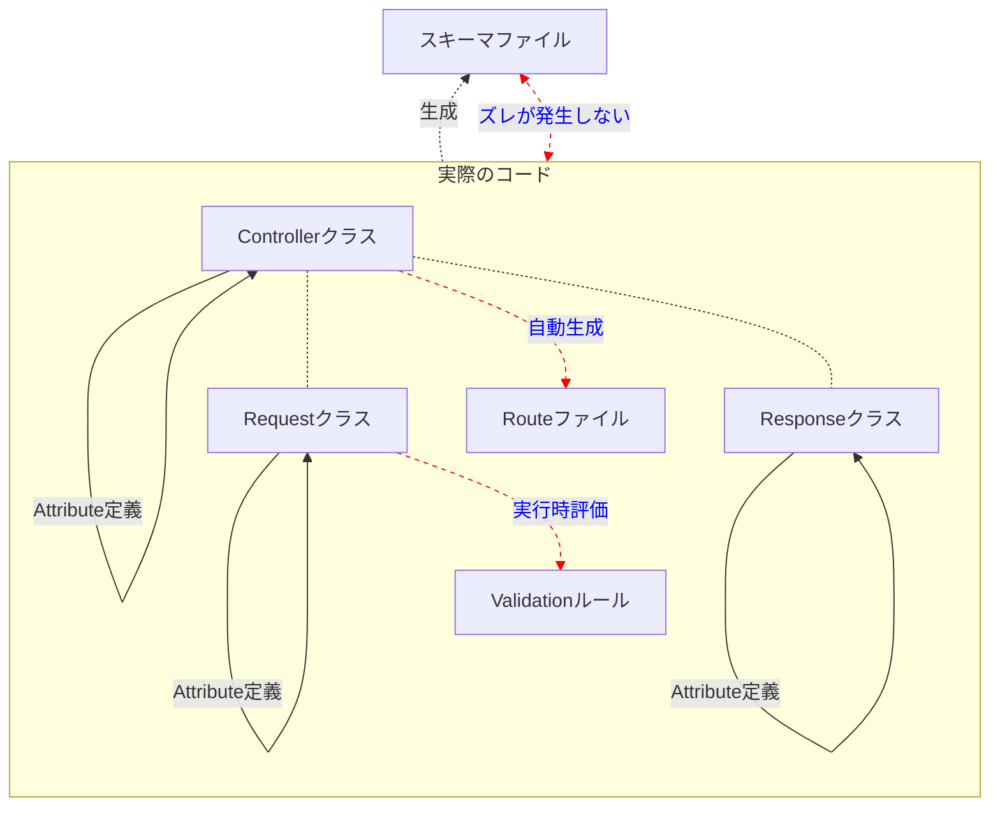
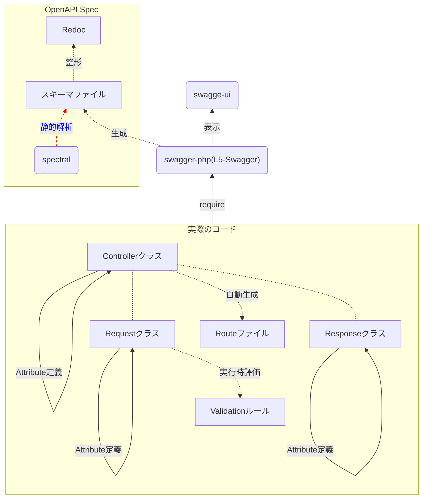
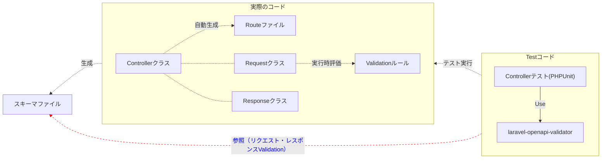
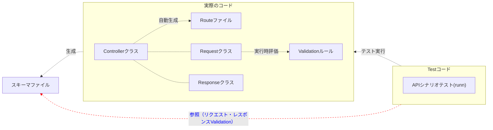

---
# try also 'default' to start simple
theme: seriph
# random image from a curated Unsplash collection by Anthony
# like them? see https://unsplash.com/collections/94734566/slidev
background: https://source.unsplash.com/collection/94734566/1920x1080
# apply any windi css classes to the current slide
class: 'text-center'
# https://sli.dev/custom/highlighters.html
highlighter: shiki
# show line numbers in code blocks
lineNumbers: false
# some information about the slides, markdown enabled
info: |
  ## Slidev Starter Template
  Presentation slides for developers.

  Learn more at [Sli.dev](https://sli.dev)
# persist drawings in exports and build
drawings:
  persist: false
# page transition
transition: slide-left
# use UnoCSS
css: unocss
fonts:
  # basically the text
  sans: 'Noto Sans JP'
  # use with `font-serif` css class from windicss
  serif: 'Noto Serif JP'
  # for code blocks, inline code, etc.
  mono: 'Noto Sans Mono'
---

# 実装と乖離させないスキーマ駆動開発フロー / OpenAPI Laravel編

<!-- June 24, 2023.  -->
v0.0.3

<div class="pt-12">
  <span @click="$slidev.nav.next" class="px-2 py-1 rounded cursor-pointer" hover="bg-white bg-opacity-10">
    Press Space for next page <carbon:arrow-right class="inline"/>
  </span>
</div>

<div class="abs-br m-6 flex gap-2">
  <button @click="$slidev.nav.openInEditor()" title="Open in Editor" class="text-xl slidev-icon-btn opacity-50 !border-none !hover:text-white">
    <carbon:edit />
  </button>
  <a href="https://github.com/slidevjs/slidev" target="_blank" alt="GitHub"
    class="text-xl slidev-icon-btn opacity-50 !border-none !hover:text-white">
    <carbon-logo-github />
  </a>
</div>

<!--
The last comment block of each slide will be treated as slide notes. It will be visible and editable in Presenter Mode along with the slide. [Read more in the docs](https://sli.dev/guide/syntax.html#notes)
-->

---
transition: fade-out
layout: two-cols-header
---

# 自己紹介

katzumiと申します  

以下のアカウントで活動しています

::left::


<logos-twitter /> [katzchum](https://twitter.com/katzchum)

::right::


<logos-github-octocat /> [k2tzumi](https://github.com/k2tzumi)  
<simple-icons-zenn /> [katzumi](https://zenn.dev/katzumi)  


<style>
h1 {
  background-color: #2B90B6;
  background-image: linear-gradient(45deg, #4EC5D4 10%, #146b8c 20%);
  background-size: 100%;
  -webkit-background-clip: text;
  -moz-background-clip: text;
  -webkit-text-fill-color: transparent;
  -moz-text-fill-color: transparent;
}
</style>


---
transition: slide-up
layout: default
---

# スキーマ駆動開発のフローってどうやっていますか？
本LTではクライアント（フロントエンド）の実装はさておいて、主にAPI（バックエンド）の実装についてお話します。

<div v-click>

- ドキュメント（スキーマ定義の仕様書）が先？

</div>

<div v-click>

- APIの実装（コード）が先？

</div>

---

# 問題点

- スキーマ定義（ドキュメント）と実際の実装（コード）が乖離してしまう


---
clicks: 3
---

# なぜ乖離が発生するのか？
ドキュメントが先の場合（コードが先であっても。。）

<div v-click-hide="2"><div v-click="1">

</div></div>
<div v-click-hide="3"><div v-click="2">

</div></div>
<div v-click-hide="4">
<div v-click="3">

</div>
</div>

---
layout: center
---

# つらい、、

---
layout: center
---

# なぜ？

---

# スキーマとコードとの距離が離れてしまっている
独立したものになっていて、乖離が発生したことを見落としがち



---
layout: center
---

# どうすれば距離が縮まるか？

---
layout: two-cols-header
_scale: 0.75
---

# スキーマ定義をコードに埋め込むという方法

[swagger-php](https://github.com/zircote/swagger-php) のAttributeを使ってスキーマを定義する

<template v-slot:left>

### Controller
```php
<?php

use OpenApi\Attributes as OA;

#[OA\Info(title: "My First API", version: "0.1")]
class OpenApi {}

class MyController {

    #[OA\Get(path: '/api/data.json')]
    #[OA\Response(response: '200', description: 'The data')]
    public function getResource() {
        // ...
    }
}
```
</template>

<template v-slot:right>

### Request
```php
<?php

use OpenApi\Attributes as OA;
use Illuminate\Foundation\Http\FormRequest;

#[OA\Schema(schema: 'CreateUserRequest', title: 'ユーザー生成のリクエスト', description: 'ユーザー生成のリクエストパラメータ',required: ['username', 'email', 'password', 'userStatus'])]
class CreateUserRequest extends FromRequest
{
    use BaseRequestTrait;

    #[OA\Property('username', description: 'ユーザー名',
      type: 'string', maxLength: 100,
      pattern: '^[a-zA-Z\d]{4,100}', example: 'scott',
      nullable: false)]
    public string $username;

    #[OA\Property('email', description: 'メールアドレス',
      type: 'string', maxLength: 320,
      pattern: '^[a-zA-Z0-9_.+-]+@([a-zA-Z0-9][a-zA-Z0-9-]*[a-zA-Z0-9]*\.)+[a-zA-Z]{2,}$',
      example: 'abc@example.com',nullable: false)]
    public string $email;

    #[OA\Property('password', description: 'パスワード',
      type: 'string', minLength: 8, maxLength: 100,
      pattern: '^[a-zA-Z\d]{8,100}',
      nullable: false)]
    public string $password;

    #[OA\Property('phone', description: '電話番号',
      type: 'string', minLength: 10, maxLength: 11,
      pattern: '^0\d{9,10}$', example: '0322222222',
      nullable: true)]
    public ?string $phone;

    #[OA\Property('userStatus', description: 'ステータス',
      type: ‘integer’, format: ‘int32’,
      enum: UserStatus::clas, example: UserStatus::NORMAL,
      nullable: false)]
    public int $userStatus;
}
```
</template>


---
layout: fact
---

## <emojione-thumbs-up /> レビューしやすい
視点移動が少なくて済む

---

# 絶対スキーマから乖離させないマン

Attributeや実際に出力されたスキーマファイルを活用してスキーマとコードを乖離させない仕組み


---
layout: center
---

# Attributeの力を引き出してみる!

---
clicks: 2
_scale: 0.50
---

# Arttibuteはコードの一部！
ReflectionClassを使ってArttibuteを読み出してゴニョゴニョする

<div v-click-hide="2"><div v-click="1">

</div></div>
<div v-click="2">

</div>

---
layout: center
---

# スキーマ自体も静的解析すべし！



<!--
人がレビューしやすいようにRedoc化させる前にlinterする
後続処理の品質を担保する上で重要になります
-->

---

# リクエスト・レスポンスの正確性を保証させる

Controllerテストで [laravel-openapi-validator]() を利用してリクエストとレスポンスを検証




---


# より確実にE2Eで検証

APIシナリオテスト（ [runn](https://github.com/k1LoW/runn) ）でユースケースを網羅的に検証




---
layout: image-right
image: https://source.unsplash.com/collection/94734566/960x1080
---

# まとめ


---
layout: fact
---

## スキーマ≠ドキュメント

スキーマはコードの一部

---
layout: fact
---

## スキーマをいつ書くか？

コードを書いたら勝手にスキーマ定義がいい感じに出力されている状態

---
layout: fact
---

## スキーマ自体もテストが必要

静的解析して最低限の品質を確保  
テストでの検証にも利用してスキーマを含んだAPI自体の品質も向上させる

---

# 参考URL

* 実装と乖離させないスキーマ駆動開発フロー / OpenAPI Laravel編    
https://zenn.dev/katzumi/articles/schema-driven-development-flow  
* swagger-php  
https://github.com/zircote/swagger-php
* spectral  
https://github.com/stoplightio/spectral
* laravel-openapi-validator  
https://github.com/kirschbaum-development/laravel-openapi-validator
* runn  
https://github.com/k1LoW/runn

---
layout: end
---

ご清聴ありがとうございます